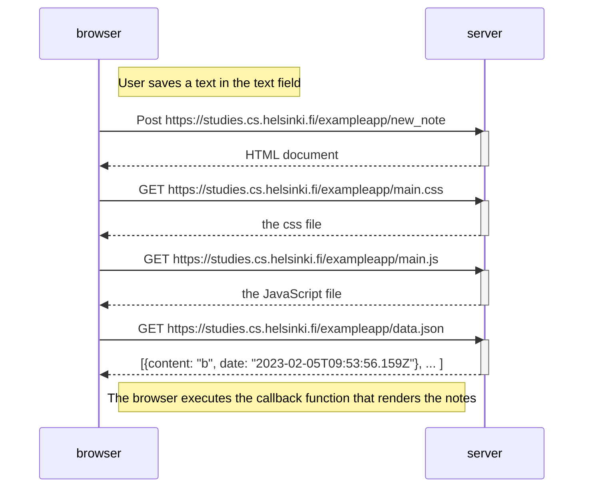

```mermaid

sequenceDiagram
    participant browser
    participant server

    Note right of browser: User saves a text in the text field

    browser->>server: Post https://studies.cs.helsinki.fi/exampleapp/new_note
    activate server
    server-->>browser: HTML document
    deactivate server

    browser->>server: GET https://studies.cs.helsinki.fi/exampleapp/main.css
    activate server
    server-->>browser: the css file
    deactivate server

    browser->>server: GET https://studies.cs.helsinki.fi/exampleapp/main.js
    activate server
    server-->>browser: the JavaScript file
    deactivate server

    

    browser->>server: GET https://studies.cs.helsinki.fi/exampleapp/data.json
    activate server
    server-->>browser: [{content: "b", date: "2023-02-05T09:53:56.159Z"}, ... ]
    deactivate server

    Note right of browser: The browser executes the callback function that renders the notes


```
